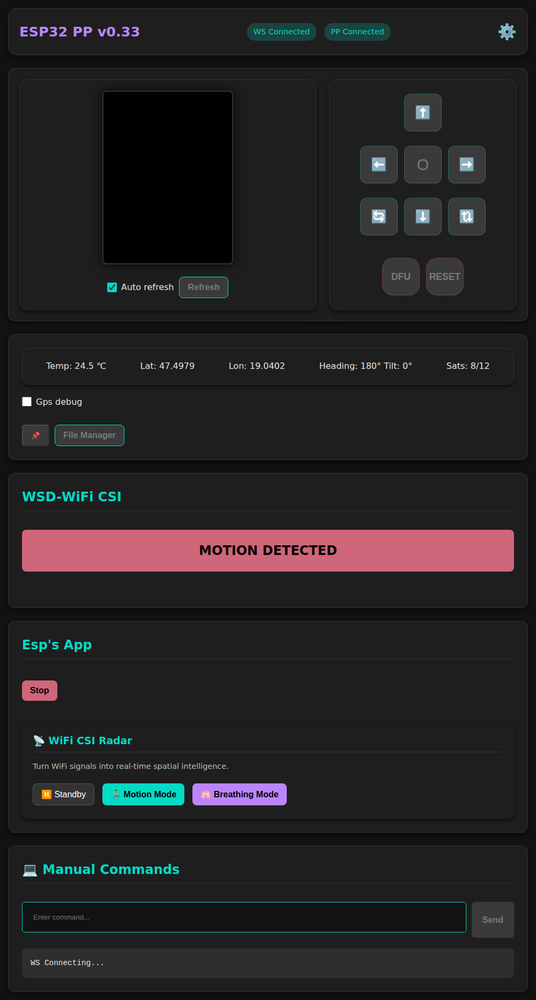

# ESP32-Portapack (ESP32PP)
An addon module for Portapack H4 / PortaRF to add GPS and extra sensors to it for more fun. (H2 too, but needs HW mod)

**This module is in early development. Suggest features via Issues, even for this module, even for the PortaPack (HackRf) part.**

## How to build one for yourself, or other questions? Check WIKI!
If you got the MDK hardware, it has a different pinout, so check the corresponding wiki page for that! Also download the right binary!

### Features:

- **Web interface** with remote control
- **GPS**
- **Compass**
- **Temperature + humidity + pressure + light**
- **WiFi CSI motion detection / radar**
- Portapack / PortaRF I2C interface support! Can add unique apps to PortaX!
- On system apps! The ESP can handle it's own apps built into it. For example Wifi SSID spoofer. (see [Wiki](https://github.com/htotoo/ESP32-Portapack/wiki/On-system-apps) for it)

For detailed info check Wiki

### Features not yet ready: 

- **IR blaster**
  - To add IR remote functions to PP. May be available only over I2C connection. Now only experimental RX.

- **LoRa**
  - Meshtastic support. (functions not yet decided for it)

### Standalone apps
The module will supply additional apps for PortaX devices. Check the list in the [Wiki](https://github.com/htotoo/ESP32-Portapack/wiki/Apps-over-I2C)

Suggest in Issues if you get any ideas.

### Screenshots:
**ADS-B with location**

  

**ExtSensor app**

**Fox hunt app**

**SatTrack**

**Web app**

**Web app mit WiFi CSI**

**Example assembly**

**Flashing**

### More info
You can get more info in the [Wiki page](https://github.com/htotoo/ESP32-Portapack/wiki). Like, what modules are supported, functions with details. How to build and wire the module. How to flash it. How to start using it.
 

### Support
- Links are affiliate links! If you don't want to use them, feel free to just search for the modules yourself. Using the affiliate links gives me some credits, so I can buy and integrate more modules to this (or other) projects.
- If you want, you can buy me a coffee (fuel of programmers): https://www.buymeacoffee.com/htotoo
- This FW will be always open source and free to use all functions!
